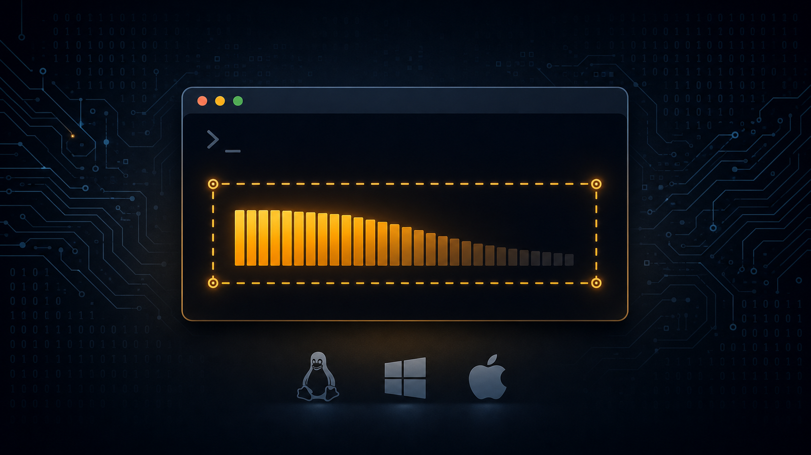

# MemCordon



MemCordon applies a memory policy to a command and its descendants: cgroup v2
and Job Object hard limits on Linux and Windows, and sampled watchdog
enforcement on macOS. When it detects the configured limit, it terminates the
workload.

## Install

Download the [latest release](https://github.com/Portfoligno/memcordon/releases/latest)
for your platform and place `memcordon` (`.exe`) on `PATH`, or install with
Cargo:

```console
cargo install memcordon
```

## Run

```console
memcordon run --memory 8GiB -- cargo test --workspace
```

Replace `cargo test --workspace` with your command. Everything after `--` is
passed to it unchanged.

## Reference

- [CLI and platform behavior](docs/reference.md)
- [Rust API](https://docs.rs/memcordon/)
- [Changelog](CHANGELOG.md)
